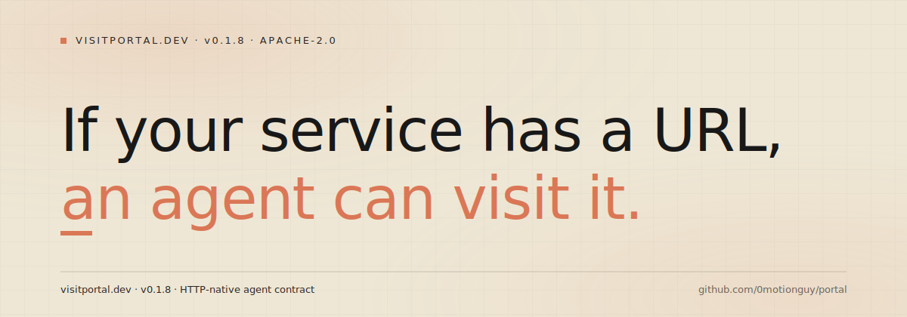
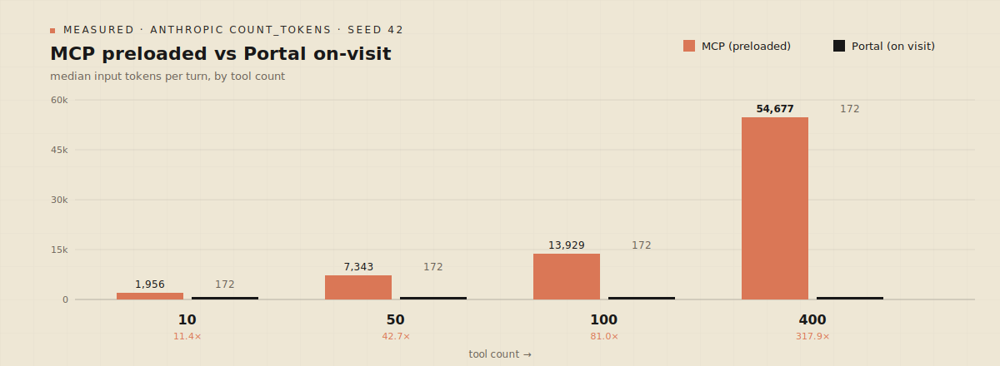
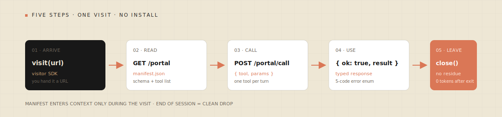

<div align="center">



# Portal

**The drop-in visit layer for Claude Code and any LLM client.**
Two HTTP endpoints. One JSON manifest. Zero install on the visitor side.

[](https://www.npmjs.com/package/@visitportal/spec)
[](https://github.com/0motionguy/portal/actions)
[](docs/spec-v0.1.1.md)
[](LICENSE)
[](https://cerebralvalley.ai/e/built-with-4-7-hackathon)

[Quickstart](#quickstart) · [Spec v0.1.1](docs/spec-v0.1.1.md) · [Benchmark](packages/bench/results/tokens-matrix-v1.md) · [Adopter debrief](docs/ADOPTER-DEBRIEF.md) · [Roadmap](docs/ROADMAP.md)

</div>

---

## Why Portal

> **MCP solved integration. Portal solves scale.**
> Portal is not a competitor — it is the visitor-side half of the open agent web.

Every tool you wire into an agent via preloaded schemas pays a per-turn tax. In the MCP path every tool description is re-sent on every turn, forever. At 100 tools that is ~14,000 input tokens *per message*. At 400 tools, ~55,000.

Portal flips the load model. The visiting agent opens the Portal, reads a single compact manifest **once per visit**, calls a tool, and leaves. No preloaded schemas, no ongoing residue, no install on the visitor side.



**81× less schema overhead at 100 tools. 317.9× at 400. A flat 172-token ceiling, regardless of catalog size** — numbers come from `pnpm bench` against Anthropic's `count_tokens` API (Sonnet 4.5 and Opus 4.5, same tokenizer, seed 42). See [`packages/bench/results/tokens-matrix-v1.md`](packages/bench/results/tokens-matrix-v1.md) for the raw matrix.

---

## Quickstart

### See it in 30 seconds

```sh
pnpm install
bash scripts/demo.sh          # ~6 s end-to-end: boots Portal, visits it, leaves
```

> Requires **Node 22+**, **pnpm 10+**, and a Unix-like shell (`scripts/demo.sh` uses bash idioms — WSL2, Git Bash, macOS, or Linux). A PowerShell equivalent is deferred to v0.1.2.

### Visit any Portal from TypeScript

```ts
import { visit } from "@visitportal/visit";

// Production:
const portal = await visit("https://demo.visitportal.dev/portal");

// Or against a local reference Portal:
// const portal = await visit("http://localhost:3075/portal", { allowInsecure: true });

const top = await portal.call("top_gainers", { limit: 3 });
// { ok: true, result: { repos: [...] } }
```

Visitors are **fire-and-forget** — no `close()` or lifecycle. When you're done, drop the reference and the garbage collector handles the rest.

### Expose your service as a Portal

Add two routes to your existing HTTP server:

```ts
// GET /portal — your manifest
app.get("/portal", (_req, res) => res.json(manifest));

// POST /portal/call — dispatch to your existing functions
app.post("/portal/call", async (req, res) => {
  const { tool, params } = req.body;
  const result = await dispatch(tool, params);
  res.json({ ok: true, result });
});
```

### Validate conformance in 30 seconds

```ts
import { runSmokeConformance } from "@visitportal/spec";

const report = await runSmokeConformance("https://your-service.com/portal");
// { target, manifestOk, manifestErrors, notFoundOk, notFoundDetail }
```

Full adopter guide: [`docs/quickstart-provider.md`](docs/quickstart-provider.md).

---

## How it works



A Portal visit is five steps: **arrive, read, call, use, leave.** The manifest enters the LLM's context only for the duration of the visit; the session end is a clean drop. No per-connection state on the server, no residue on the client.

Full technical flow in [`docs/architecture.md`](docs/architecture.md). One-page spec in [`docs/spec-v0.1.1.md`](docs/spec-v0.1.1.md).

---

## What's in this repo

| Package | Version | Purpose |
|---|---|---|
| [`@visitportal/spec`](packages/spec) | `0.1.1` · published on npm | JSON Schema, 30 conformance vectors, ajv + zero-dep lean validator, smoke runner |
| [`@visitportal/visit`](packages/visit/ts) | `0.1.1` · hackathon-week, run from clone | TypeScript visitor SDK — `visit(url)` → `Portal` |
| [`@visitportal/cli`](packages/cli) | `0.1.1` · hackathon-week, run from clone | `visit-portal info \| call \| conformance` |
| [`@visitportal/bench`](packages/bench) | — | Reproducible MCP-vs-Portal benchmark, Anthropic `count_tokens` |
| [`reference/trending-demo`](reference/trending-demo) | — | Reference Portal ("Star Screener"), Hono, 3 tools, frozen 30-repo snapshot |
| [`packages/visit/py`](packages/visit/py) | stub | Python SDK (v0.2) |
| [`packages/mcp-adapter`](packages/mcp-adapter) | stub | Wrap MCP servers as Portals (v0.2) |
| [`web/`](web) | — | [visitportal.dev](https://visitportal.dev) landing + docs |

Import direction is strictly downhill — upper layers import from lower, never the reverse. Base Portal packages never pull AGP / ClawPulse / AGNT / ERC-8004; those are optional Portal Extensions documented in [`docs/extensions/`](docs/extensions/).

---

## First-adopter debrief

Portal was independently adopted by a production service (Star Screener) in **~2h15m** of engineering time. The protocol itself survived first contact with reality — **8/8 conformance checks passed** on the first green run. Of that 2h15m, ~25 minutes was avoidable friction (packaging, naming) — all addressed in v0.1.1.

> *"The core spec is solid. The adopter onramp is what needs work."* — first production adopter, April 2026

Full debrief: [`docs/ADOPTER-DEBRIEF.md`](docs/ADOPTER-DEBRIEF.md).

---

## Positioning — not a competitor

Portal is a strict subset designed for drive-by visits. It composes with MCP, A2A, and Skills; it does not replace any of them.

| | **Purpose** | **Use when…** |
|---|---|---|
| **MCP** | Installed tools your agent uses daily | You want long-running, trusted tool usage |
| **A2A** | Multi-agent task coordination with lifecycles | You need state, artifacts, or streaming |
| **Skills** | Procedural knowledge preloaded into an agent | You need playbooks and recipes |
| **Portal** | Drop-in visits — no install, zero residue | You want the open web of agents |

Portal wraps an MCP server in a thin adapter (planned — `packages/mcp-adapter`). Portal visits can upgrade to A2A when a job needs tasks. Portal composes with Skills: Skills teach the agent what to do, Portal gives it the live capability on arrival.

---

## Benchmark

All numbers reproducible from a clean clone. Source of truth: [`packages/bench/results/tokens-matrix-v1.json`](packages/bench/results/tokens-matrix-v1.json).

| Tool count | MCP (median input tokens) | Portal | MCP : Portal |
|---:|---:|---:|---:|
|  10 |  1,956 | 172 |  **11.4×** |
|  50 |  7,343 | 172 |  **42.7×** |
| 100 | 13,929 | 172 |  **81.0×** |
| 400 | 54,677 | 172 | **317.9×** |

MCP cost scales linearly at ~137 tokens per preloaded tool. Portal stays flat at 172 tokens regardless of catalog size. Sonnet 4.5 and Opus 4.5 return byte-identical token counts (same tokenizer).

```sh
export ANTHROPIC_API_KEY=sk-ant-...
BENCH_MODE=count_tokens_only pnpm --filter @visitportal/bench bench
# 48 cells via Anthropic's count_tokens API in ~20 s, ≈ $0.10 total
```

Methodology: [`packages/bench/METHODOLOGY.md`](packages/bench/METHODOLOGY.md).

---

## Spec — v0.1.1

Two endpoints (`GET /portal`, `POST /portal/call`). One manifest. A five-code error enum (`NOT_FOUND`, `INVALID_PARAMS`, `UNAUTHORIZED`, `RATE_LIMITED`, `INTERNAL`). Dual params form — simple sugar plus an escape hatch for full JSON Schema. One printed page of core + appendices A–D (examples, versioning, CORS, rate-limit defaults).

Explicit non-goals for v0.1: task lifecycles, stateful sessions, server-initiated messages, streaming, multi-agent choreography. Those live in MCP / A2A, or arrive as Portal Extensions (PE-001 verified identity, PE-002 x402 micropayments, …).

Full spec: [`docs/spec-v0.1.1.md`](docs/spec-v0.1.1.md).

---

## Reproduce everything

```sh
pnpm -r build                 # strict tsc across every package
pnpm -r test                  # spec 30 + bench 65 + visit 14 + cli 6 + ref 6 = 121 tests
pnpm --filter @visitportal/visit size     # enforce SDK bundle size (limit 15 kB gzipped)
pnpm conformance <url>        # live-validate any v0.1 Portal
```

Verification standard: every claim on [visitportal.dev](https://visitportal.dev) is traceable to a JSON artifact in [`packages/bench/results/`](packages/bench/results/) or a single `curl`. If a measurement disagrees with the one-pager, the one-pager updates — not the measurement.

---

## Roadmap

### v0.1.1 — shipped

- [x] `@visitportal/spec` published on npm (Apache 2.0 + CC0)
- [x] Normative CORS appendix + SHOULD-level rate-limit defaults (spec Appendix C, D)
- [x] `call_endpoint` tightened to HTTPS-only with loopback escape
- [x] `runConformance` → `runSmokeConformance` + `validateAgainstVectors()` for offline full-suite checking
- [x] SSRF hardening on `/api/visit` (`ipaddr.js` + DNS resolution)
- [x] First-adopter debrief published
- [x] Windows shell requirement documented for `scripts/demo.sh`

### v0.1.2 — next

- [ ] Relative `call_endpoint` resolution (kills a class of copy-paste bugs)
- [ ] `paramsSchema` (JSON Schema 2020-12) alongside sugar `params`
- [ ] Framework quickstarts: Next.js App Router, Hono, FastAPI, Express
- [ ] PowerShell `demo.ps1`

### v0.2

- [ ] Python visitor SDK
- [ ] MCP → Portal adapter
- [ ] `@visitportal/cli` published to npm as global binary
- [ ] Pagination envelope (`{ ok, result, next_cursor }`)
- [ ] Deprecation path for `params` sugar (paramsSchema-only in v0.2)

Full roadmap: [`docs/ROADMAP.md`](docs/ROADMAP.md).

---

## Contributing

Portal is an open standard. Contributions welcome — spec proposals, SDKs in new languages, reference adopters, docs improvements.

1. `pnpm install && pnpm -r build && pnpm -r test` must go green on a clean clone.
2. One concern per PR. Hard ceiling: 400 lines of net change.
3. Spec changes bump the spec version and go through a proposal in `docs/proposals/`.
4. No `AGP` / `ClawPulse` / `AGNT` / `8004` imports in base Portal packages — those are extensions.

Full guide: [`CONTRIBUTING.md`](CONTRIBUTING.md) · Security policy: [`SECURITY.md`](SECURITY.md).

---

## License

Dual-licensed. **Code** under Apache 2.0. **Spec documents + `conformance/vectors.json`** under CC0 1.0 (public domain). See [`LICENSE`](LICENSE).

---

## Credits

Built with **Opus 4.7** for the Claude Code *"Built with Opus 4.7"* hackathon, April 2026, by Mirko Basil Dölger ([@0motionguy](https://github.com/0motionguy)).

The Portal spec is open, unowned, and designed to complement MCP / A2A / Skills — not compete with them. MCP is the foundation.

<div align="center">

---

**Visit. Don't install.**

[visitportal.dev](https://visitportal.dev) · [GitHub](https://github.com/0motionguy/portal) · [Issues](https://github.com/0motionguy/portal/issues)

</div>
